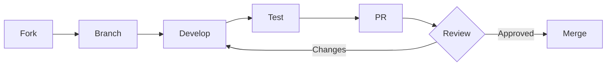

# Contributing to Raptor HR

Thank you for your interest in contributing to Raptor HR! This document provides guidelines and information for contributors.

## Code of Conduct

Please be respectful and considerate in all interactions. We are committed to providing a welcoming and inclusive environment for everyone.

## Getting Started

### Development Setup

1. **Clone the repository:**
   ```bash
   git clone https://github.com/your-org/rhr.git
   cd rhr
   ```

2. **Start with Docker (recommended):**
   ```bash
   docker compose up -d
   docker compose exec backend python manage.py migrate
   ```

3. **Or set up manually:**
   - See [Development Guide](docs/development.md) for detailed instructions

### Running Tests

```bash
# Backend
cd backend && pytest

# Frontend
cd frontend && npm test
```

## How to Contribute

### Reporting Issues

Before creating an issue:
1. Search existing issues to avoid duplicates
2. Use the issue templates when available
3. Provide detailed reproduction steps for bugs

### Pull Requests

1. **Fork the repository** and create your branch from `main`
2. **Follow the branch naming convention:**
   - `feature/description` - New features
   - `fix/description` - Bug fixes
   - `chore/description` - Maintenance tasks
   - `docs/description` - Documentation updates

3. **Write clear commit messages** following conventional commits:
   ```
   type(scope): description

   [optional body]

   [optional footer]
   ```

   Types: `feat`, `fix`, `docs`, `style`, `refactor`, `test`, `chore`

   Examples:
   ```
   feat(employees): add bulk import functionality
   fix(auth): resolve token refresh race condition
   docs(api): update authentication examples
   ```

4. **Ensure all tests pass** and add new tests for your changes

5. **Update documentation** if you're changing functionality

6. **Submit your PR** with a clear description of changes

## Code Standards

### Python (Backend)

- **Style:** Follow PEP 8, enforced by Ruff
- **Type hints:** Use type annotations for all functions
- **Docstrings:** Use docstrings for modules, classes, and public functions
- **Imports:** Use absolute imports, sorted by Ruff

```python
# Good
from apps.employees.models import Employee
from apps.core.models import TenantAwareModel

def get_employee(employee_id: int) -> Employee:
    """Retrieve an employee by ID."""
    return Employee.objects.get(id=employee_id)
```

Run linting:
```bash
cd backend
ruff check .
ruff format .
mypy apps
```

### TypeScript (Frontend)

- **Style:** Follow ESLint configuration
- **Types:** Use explicit types, avoid `any`
- **Components:** Use functional components with hooks
- **Naming:** PascalCase for components, camelCase for functions/variables

```typescript
// Good
interface EmployeeCardProps {
  employee: Employee;
  onEdit: (id: number) => void;
}

function EmployeeCard({ employee, onEdit }: EmployeeCardProps) {
  return (
    <Card>
      <h3>{employee.fullName}</h3>
      <Button onClick={() => onEdit(employee.id)}>Edit</Button>
    </Card>
  );
}
```

Run linting and type checking:
```bash
cd frontend
npm run lint          # Check for lint errors
npm run lint:fix      # Auto-fix lint errors
npm run typecheck     # TypeScript type checking
```

## Testing Requirements

### Backend

- Write tests for all new functionality
- Maintain minimum 70% code coverage
- Use pytest fixtures and factories

```python
import pytest
from apps.employees.models import Employee

@pytest.fixture
def employee(tenant):
    return Employee.objects.create(
        tenant=tenant,
        employee_id="EMP001",
        first_name="John",
        last_name="Doe",
        hire_date="2024-01-01",
    )

def test_employee_full_name(employee):
    assert employee.full_name == "John Doe"
```

### Frontend

- Test components with React Testing Library
- Test hooks in isolation
- Focus on user behavior, not implementation

```typescript
import { render, screen } from '@testing-library/react';
import { EmployeeCard } from './EmployeeCard';

test('displays employee name', () => {
  render(<EmployeeCard employee={mockEmployee} onEdit={vi.fn()} />);
  expect(screen.getByText('John Doe')).toBeInTheDocument();
});
```

## PR Review Process

1. All PRs require at least one approval
2. CI checks must pass
3. Coverage gates must be met
4. No unresolved comments

### Review Checklist

- [ ] Code follows project style guides
- [ ] Tests are included and passing
- [ ] Documentation is updated
- [ ] No security vulnerabilities introduced
- [ ] Performance considerations addressed
- [ ] Backwards compatibility maintained (or breaking changes documented)

## Development Workflow



### Branch Protection

The `main` branch is protected:
- Direct pushes are not allowed
- PRs require passing CI
- PRs require review approval

## Release Process

Releases are managed by maintainers:

1. Version is bumped in `pyproject.toml` and `package.json`
2. CHANGELOG.md is updated
3. A git tag is created
4. GitHub Release is published
5. Docker images are built and pushed

## Getting Help

- **Documentation:** Check the [docs folder](docs/)
- **Issues:** Search or create an issue
- **Discussions:** Use GitHub Discussions for questions

## License

By contributing, you agree that your contributions will be licensed under the MIT License.
