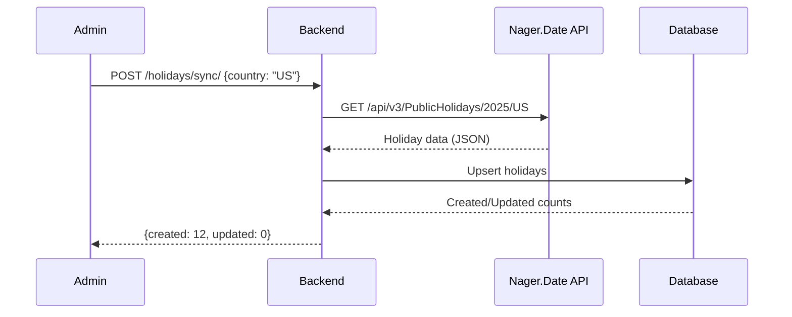
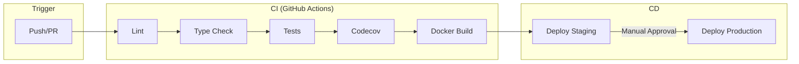

# System Architecture

This document describes the high-level architecture of Raptor HR.

## System Overview

## Component Responsibilities

### Frontend (React + TypeScript)

| Component | Responsibility |
|-----------|----------------|
| **React** | UI rendering and component lifecycle |
| **TanStack Query** | Server state management, caching, background updates |
| **Zustand** | Client-side state (auth, UI preferences) |
| **React Router** | Client-side routing |
| **Ant Design** | UI component library |

### Backend (Django REST Framework)

| Component | Responsibility |
|-----------|----------------|
| **DRF ViewSets** | API endpoints and request handling |
| **Tenant Middleware** | Multi-tenant request isolation |
| **SimpleJWT** | JWT token authentication |
| **Celery** | Async task processing |

### Data Layer

| Component | Responsibility |
|-----------|----------------|
| **PostgreSQL** | Primary data storage |
| **Redis** | Session cache, Celery message broker |
| **File Storage** | Media files (logos, avatars, documents) |

## Request Flow

## Authentication Flow

## Multi-Tenancy Architecture

See [Multi-Tenancy](./multi-tenancy.md) for detailed documentation.

## Deployment Architecture

## External Integrations

### Nager.Date API (National Holidays)

The platform integrates with [Nager.Date](https://date.nager.at/) to sync national holidays.

**Sync Methods:**
- **API Endpoint**: `POST /api/v1/holidays/sync/` (admin-only)
- **Management Command**: `python manage.py sync_holidays`

**Data Stored:**
- Holiday name (English and local)
- Date and country code
- Holiday types (Public, Bank, National, etc.)
- Source tracking (`nager_date` vs `manual`)

## CI/CD Pipeline

## Technology Decisions

### Why Django REST Framework?
- Mature ecosystem with excellent documentation
- Built-in support for authentication, permissions, serialization
- Strong typing support via django-stubs
- Excellent ORM for complex queries

### Why React + TypeScript?
- Component-based architecture scales well
- TypeScript catches errors at compile time
- Large ecosystem of libraries and tools
- TanStack Query simplifies server state management

### Why PostgreSQL?
- ACID compliance for financial/HR data
- Excellent JSON support for flexible schemas
- Strong indexing capabilities
- Battle-tested reliability

### Why Redis?
- Fast in-memory caching
- Native support as Celery broker
- Session storage capabilities
- Pub/sub for real-time features (future)
