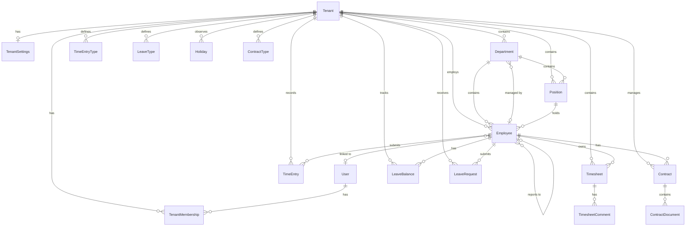

# Database Schema

This document describes the data model and relationships in Raptor HR.

## Entity Relationship Diagram



## Core Models

### Tenant

The root entity for multi-tenancy. All tenant-scoped data is isolated by tenant.

| Field | Type | Description |
|-------|------|-------------|
| id | Integer | Primary key |
| name | String(255) | Organization name |
| slug | String(100) | URL-safe identifier (unique) |
| domain | String(255) | Custom domain (optional) |
| is_active | Boolean | Tenant active status |
| logo | Image | Organization logo |
| plan | Enum | Subscription plan |
| max_employees | Integer | Employee limit by plan |
| created_at | DateTime | Record creation time |
| updated_at | DateTime | Last update time |

### User

System users who can access the application.

| Field | Type | Description |
|-------|------|-------------|
| id | Integer | Primary key |
| email | String(255) | Email address (unique, login) |
| first_name | String(150) | First name |
| last_name | String(150) | Last name |
| is_active | Boolean | Account active status |
| is_staff | Boolean | Django admin access |
| avatar | Image | Profile picture |
| created_at | DateTime | Record creation time |
| updated_at | DateTime | Last update time |

### TenantMembership

Links users to tenants with role-based access.

| Field | Type | Description |
|-------|------|-------------|
| id | Integer | Primary key |
| user_id | FK(User) | User reference |
| tenant_id | FK(Tenant) | Tenant reference |
| role | Enum | owner, admin, manager, employee, viewer |
| is_default | Boolean | Default tenant for user |

## Employee Management

### Department

Organizational units within a tenant.

| Field | Type | Description |
|-------|------|-------------|
| id | Integer | Primary key |
| tenant_id | FK(Tenant) | Tenant reference |
| name | String(255) | Department name |
| code | String(50) | Department code |
| description | Text | Description |
| parent_id | FK(Department) | Parent department |
| manager_id | FK(Employee) | Department manager |
| is_active | Boolean | Active status |

### Position

Job titles/positions within a tenant.

| Field | Type | Description |
|-------|------|-------------|
| id | Integer | Primary key |
| tenant_id | FK(Tenant) | Tenant reference |
| title | String(255) | Position title |
| code | String(50) | Position code |
| description | Text | Job description |
| department_id | FK(Department) | Associated department |
| level | Integer | Seniority level (1-5) |
| is_active | Boolean | Active status |

### Employee

Employee records within a tenant.

| Field | Type | Description |
|-------|------|-------------|
| id | Integer | Primary key |
| tenant_id | FK(Tenant) | Tenant reference |
| user_id | FK(User) | Linked user account (optional) |
| employee_id | String(50) | Employee ID (unique per tenant) |
| first_name | String(150) | First name |
| last_name | String(150) | Last name |
| email | Email | Work email |
| phone | String(50) | Phone number |
| avatar | Image | Profile picture |
| department_id | FK(Department) | Department |
| position_id | FK(Position) | Position |
| manager_id | FK(Employee) | Direct manager |
| hire_date | Date | Employment start date |
| termination_date | Date | Employment end date |
| status | Enum | active, on_leave, terminated, suspended |
| date_of_birth | Date | Birth date |
| address | Text | Home address |
| emergency_contact_name | String(255) | Emergency contact |
| emergency_contact_phone | String(50) | Emergency phone |

## Time Tracking

### TimeEntryType

Types of time entries (regular, overtime, etc.).

| Field | Type | Description |
|-------|------|-------------|
| id | Integer | Primary key |
| tenant_id | FK(Tenant) | Tenant reference |
| name | String(100) | Type name |
| code | String(20) | Type code |
| is_paid | Boolean | Is paid time |
| multiplier | Decimal(4,2) | Pay multiplier |
| color | String(7) | Hex color code |
| is_active | Boolean | Active status |

### TimeEntry

Individual time entry records.

| Field | Type | Description |
|-------|------|-------------|
| id | Integer | Primary key |
| tenant_id | FK(Tenant) | Tenant reference |
| employee_id | FK(Employee) | Employee reference |
| entry_type_id | FK(TimeEntryType) | Entry type |
| date | Date | Entry date |
| start_time | Time | Start time |
| end_time | Time | End time |
| break_minutes | Integer | Break duration |
| notes | Text | Notes |
| project | String(255) | Project name |
| task | String(255) | Task name |
| is_approved | Boolean | Approval status |
| approved_by_id | FK(Employee) | Approver |
| approved_at | DateTime | Approval time |

### Timesheet

Period-based time summaries.

| Field | Type | Description |
|-------|------|-------------|
| id | Integer | Primary key |
| tenant_id | FK(Tenant) | Tenant reference |
| employee_id | FK(Employee) | Employee reference |
| period_start | Date | Period start date |
| period_end | Date | Period end date |
| status | Enum | draft, submitted, approved, rejected |
| total_regular_hours | Decimal(6,2) | Regular hours |
| total_overtime_hours | Decimal(6,2) | Overtime hours |
| total_break_hours | Decimal(6,2) | Break hours |
| submitted_at | DateTime | Submission time |
| approved_by_id | FK(Employee) | Approver |
| approved_at | DateTime | Approval time |
| rejection_reason | Text | Rejection notes |

## Leave Management

### LeaveType

Types of leave (vacation, sick, etc.).

| Field | Type | Description |
|-------|------|-------------|
| id | Integer | Primary key |
| tenant_id | FK(Tenant) | Tenant reference |
| name | String(100) | Leave type name |
| code | String(20) | Leave type code |
| is_paid | Boolean | Is paid leave |
| requires_approval | Boolean | Requires approval |
| max_consecutive_days | Integer | Maximum consecutive days |
| color | String(7) | Hex color code |
| is_active | Boolean | Active status |

### LeaveBalance

Employee leave balances per year.

| Field | Type | Description |
|-------|------|-------------|
| id | Integer | Primary key |
| tenant_id | FK(Tenant) | Tenant reference |
| employee_id | FK(Employee) | Employee reference |
| leave_type_id | FK(LeaveType) | Leave type |
| year | Integer | Balance year |
| entitled_days | Decimal(5,2) | Entitled days |
| used_days | Decimal(5,2) | Used days |
| carried_over | Decimal(5,2) | Carried from prior year |

### LeaveRequest

Leave requests from employees.

| Field | Type | Description |
|-------|------|-------------|
| id | Integer | Primary key |
| tenant_id | FK(Tenant) | Tenant reference |
| employee_id | FK(Employee) | Requesting employee |
| leave_type_id | FK(LeaveType) | Leave type |
| start_date | Date | Leave start |
| end_date | Date | Leave end |
| is_half_day | Boolean | Half-day request |
| half_day_period | Enum | morning, afternoon |
| reason | Text | Leave reason |
| status | Enum | pending, approved, rejected, cancelled |
| reviewed_by_id | FK(Employee) | Reviewer |
| reviewed_at | DateTime | Review time |
| review_notes | Text | Review notes |

### Holiday

Company/public holidays.

| Field | Type | Description |
|-------|------|-------------|
| id | Integer | Primary key |
| tenant_id | FK(Tenant) | Tenant reference |
| name | String(255) | Holiday name |
| date | Date | Holiday date |
| is_recurring | Boolean | Recurs annually |
| applies_to_all | Boolean | All employees |
| departments | M2M(Department) | Specific departments |

## Contracts

### ContractType

Types of employment contracts.

| Field | Type | Description |
|-------|------|-------------|
| id | Integer | Primary key |
| tenant_id | FK(Tenant) | Tenant reference |
| name | String(100) | Contract type name |
| code | String(20) | Contract type code |
| description | Text | Description |
| is_active | Boolean | Active status |

### Contract

Employment contracts.

| Field | Type | Description |
|-------|------|-------------|
| id | Integer | Primary key |
| tenant_id | FK(Tenant) | Tenant reference |
| employee_id | FK(Employee) | Employee reference |
| contract_type_id | FK(ContractType) | Contract type |
| title | String(255) | Contract title |
| start_date | Date | Contract start |
| end_date | Date | Contract end (optional) |
| status | Enum | draft, active, expired, terminated |
| salary | Decimal(12,2) | Salary amount |
| salary_currency | String(3) | Currency code |
| salary_period | Enum | hourly, daily, weekly, monthly, yearly |
| hours_per_week | Decimal(4,1) | Weekly hours |
| probation_end_date | Date | Probation end |
| probation_passed | Boolean | Probation status |
| notice_period_days | Integer | Notice period |
| notes | Text | Additional notes |

## Indexes

Key indexes for query performance:

```sql
-- Tenant lookups
CREATE INDEX idx_tenant_slug ON tenants_tenant(slug);
CREATE INDEX idx_tenant_domain ON tenants_tenant(domain);

-- Employee queries
CREATE INDEX idx_employee_tenant ON employees_employee(tenant_id);
CREATE INDEX idx_employee_department ON employees_employee(department_id);
CREATE INDEX idx_employee_manager ON employees_employee(manager_id);
CREATE INDEX idx_employee_status ON employees_employee(status);

-- Time entries
CREATE INDEX idx_timeentry_employee_date ON timetracking_timeentry(employee_id, date);
CREATE INDEX idx_timeentry_tenant_date ON timetracking_timeentry(tenant_id, date);

-- Leave requests
CREATE INDEX idx_leaverequest_employee ON leave_leaverequest(employee_id);
CREATE INDEX idx_leaverequest_status ON leave_leaverequest(status);
CREATE INDEX idx_leaverequest_dates ON leave_leaverequest(start_date, end_date);
```

## Migration Strategy

### Running Migrations

```bash
# Create new migration
python manage.py makemigrations app_name

# Apply migrations
python manage.py migrate

# Check migration status
python manage.py showmigrations
```

### Best Practices

1. **Always review migrations** before applying to production
2. **Back up database** before major migrations
3. **Use atomic migrations** for data transformations
4. **Test migrations** on a copy of production data
5. **Keep migrations small** and focused
