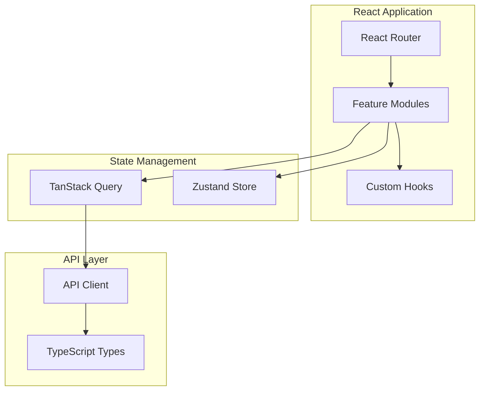
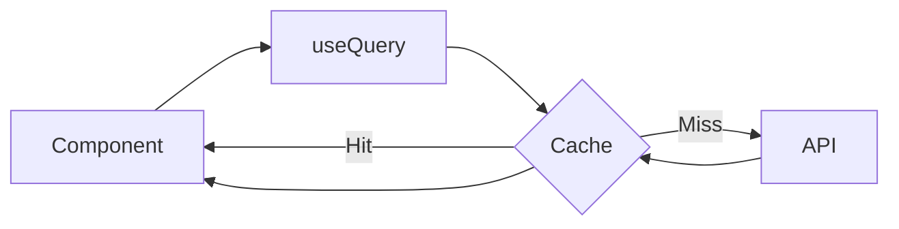

# Frontend Architecture

This document describes the React frontend architecture of Raptor HR.

## Overview



## Project Structure

```
frontend/src/
├── api/                    # API client and modules
│   ├── client.ts           # Axios instance configuration
│   ├── auth.ts             # Authentication endpoints
│   ├── employees.ts        # Employee endpoints
│   ├── timetracking.ts     # Time tracking endpoints
│   └── ...
├── features/               # Feature-based modules
│   ├── auth/               # Authentication
│   │   ├── components/     # Login, Register forms
│   │   ├── hooks/          # useAuth, useLogin
│   │   └── pages/          # LoginPage, RegisterPage
│   ├── dashboard/          # Dashboard
│   ├── employees/          # Employee management
│   ├── timetracking/       # Time tracking
│   ├── timesheets/         # Timesheets
│   ├── leave/              # Leave management
│   └── contracts/          # Contracts
├── hooks/                  # Shared custom hooks
├── layouts/                # Page layouts
├── stores/                 # Zustand state stores
├── types/                  # TypeScript type definitions
├── App.tsx                 # Root component with routing
└── main.tsx                # Entry point
```

## State Management

### Server State (TanStack Query)

TanStack Query manages all server-side data:

```typescript
// Fetching employees
import { useQuery } from '@tanstack/react-query';
import { getEmployees } from '@/api/employees';

function EmployeeList() {
  const { data, isLoading, error } = useQuery({
    queryKey: ['employees'],
    queryFn: getEmployees,
  });

  if (isLoading) return <Spinner />;
  if (error) return <Error message={error.message} />;

  return <Table data={data} />;
}
```



**Key benefits:**
- Automatic caching and background updates
- Request deduplication
- Optimistic updates
- Pagination and infinite scroll support

### Client State (Zustand)

Zustand manages client-side state like auth and UI preferences:

```typescript
// stores/authStore.ts
import { create } from 'zustand';
import { persist } from 'zustand/middleware';

interface AuthState {
  user: User | null;
  accessToken: string | null;
  refreshToken: string | null;
  setAuth: (user: User, tokens: Tokens) => void;
  logout: () => void;
}

export const useAuthStore = create<AuthState>()(
  persist(
    (set) => ({
      user: null,
      accessToken: null,
      refreshToken: null,
      setAuth: (user, tokens) =>
        set({
          user,
          accessToken: tokens.access,
          refreshToken: tokens.refresh,
        }),
      logout: () =>
        set({
          user: null,
          accessToken: null,
          refreshToken: null,
        }),
    }),
    {
      name: 'auth-storage',
    }
  )
);
```

Usage:
```typescript
function Header() {
  const user = useAuthStore((state) => state.user);
  const logout = useAuthStore((state) => state.logout);

  return (
    <header>
      <span>Welcome, {user?.firstName}</span>
      <button onClick={logout}>Logout</button>
    </header>
  );
}
```

## API Client

### Axios Configuration

```typescript
// api/client.ts
import axios from 'axios';
import { useAuthStore } from '@/stores/authStore';

const apiClient = axios.create({
  baseURL: import.meta.env.VITE_API_URL,
  headers: {
    'Content-Type': 'application/json',
  },
});

// Add auth token to requests
apiClient.interceptors.request.use((config) => {
  const token = useAuthStore.getState().accessToken;
  if (token) {
    config.headers.Authorization = `Bearer ${token}`;
  }

  // Add tenant header
  const tenantId = useAuthStore.getState().currentTenantId;
  if (tenantId) {
    config.headers['X-Tenant-ID'] = tenantId;
  }

  return config;
});

// Handle token refresh
apiClient.interceptors.response.use(
  (response) => response,
  async (error) => {
    if (error.response?.status === 401) {
      // Attempt token refresh
      const refreshToken = useAuthStore.getState().refreshToken;
      if (refreshToken) {
        try {
          const { data } = await axios.post('/auth/token/refresh/', {
            refresh: refreshToken,
          });
          useAuthStore.getState().setAccessToken(data.access);
          return apiClient(error.config);
        } catch {
          useAuthStore.getState().logout();
        }
      }
    }
    return Promise.reject(error);
  }
);

export default apiClient;
```

### API Modules

```typescript
// api/employees.ts
import apiClient from './client';
import { Employee, CreateEmployeeDto } from '@/types/employee';

export const getEmployees = async (): Promise<Employee[]> => {
  const { data } = await apiClient.get('/employees/');
  return data.results;
};

export const getEmployee = async (id: number): Promise<Employee> => {
  const { data } = await apiClient.get(`/employees/${id}/`);
  return data;
};

export const createEmployee = async (
  employee: CreateEmployeeDto
): Promise<Employee> => {
  const { data } = await apiClient.post('/employees/', employee);
  return data;
};

export const updateEmployee = async (
  id: number,
  employee: Partial<CreateEmployeeDto>
): Promise<Employee> => {
  const { data } = await apiClient.patch(`/employees/${id}/`, employee);
  return data;
};

export const deleteEmployee = async (id: number): Promise<void> => {
  await apiClient.delete(`/employees/${id}/`);
};
```

## Routing

```typescript
// App.tsx
import { BrowserRouter, Routes, Route, Navigate } from 'react-router-dom';
import { ProtectedRoute } from '@/components/ProtectedRoute';
import { MainLayout } from '@/layouts/MainLayout';

function App() {
  return (
    <BrowserRouter>
      <Routes>
        {/* Public routes */}
        <Route path="/login" element={<LoginPage />} />
        <Route path="/register" element={<RegisterPage />} />

        {/* Protected routes */}
        <Route element={<ProtectedRoute />}>
          <Route element={<MainLayout />}>
            <Route path="/" element={<Navigate to="/dashboard" replace />} />
            <Route path="/dashboard" element={<DashboardPage />} />
            <Route path="/employees" element={<EmployeesPage />} />
            <Route path="/employees/:id" element={<EmployeeDetailPage />} />
            <Route path="/timetracking" element={<TimeTrackingPage />} />
            <Route path="/timesheets" element={<TimesheetsPage />} />
            <Route path="/leave" element={<LeavePage />} />
            <Route path="/contracts" element={<ContractsPage />} />
          </Route>
        </Route>
      </Routes>
    </BrowserRouter>
  );
}
```

## Component Patterns

### Feature Module Structure

```
features/employees/
├── components/
│   ├── EmployeeForm.tsx        # Create/edit form
│   ├── EmployeeCard.tsx        # Display card
│   ├── EmployeeTable.tsx       # List table
│   └── EmployeeFilters.tsx     # Search/filter
├── hooks/
│   ├── useEmployees.ts         # List query
│   ├── useEmployee.ts          # Single query
│   ├── useCreateEmployee.ts    # Create mutation
│   └── useUpdateEmployee.ts    # Update mutation
├── pages/
│   ├── EmployeesPage.tsx       # List page
│   └── EmployeeDetailPage.tsx  # Detail page
└── index.ts                    # Public exports
```

### Custom Hooks

```typescript
// features/employees/hooks/useEmployees.ts
import { useQuery } from '@tanstack/react-query';
import { getEmployees } from '@/api/employees';

export function useEmployees(filters?: EmployeeFilters) {
  return useQuery({
    queryKey: ['employees', filters],
    queryFn: () => getEmployees(filters),
  });
}

// features/employees/hooks/useCreateEmployee.ts
import { useMutation, useQueryClient } from '@tanstack/react-query';
import { createEmployee } from '@/api/employees';

export function useCreateEmployee() {
  const queryClient = useQueryClient();

  return useMutation({
    mutationFn: createEmployee,
    onSuccess: () => {
      queryClient.invalidateQueries({ queryKey: ['employees'] });
    },
  });
}
```

### Form Handling

Using React Hook Form with Zod validation:

```typescript
import { useForm } from 'react-hook-form';
import { zodResolver } from '@hookform/resolvers/zod';
import { z } from 'zod';

const employeeSchema = z.object({
  firstName: z.string().min(1, 'First name is required'),
  lastName: z.string().min(1, 'Last name is required'),
  email: z.string().email('Invalid email'),
  hireDate: z.string().min(1, 'Hire date is required'),
  departmentId: z.number().optional(),
});

type EmployeeFormData = z.infer<typeof employeeSchema>;

function EmployeeForm({ onSubmit }: { onSubmit: (data: EmployeeFormData) => void }) {
  const {
    register,
    handleSubmit,
    formState: { errors },
  } = useForm<EmployeeFormData>({
    resolver: zodResolver(employeeSchema),
  });

  return (
    <form onSubmit={handleSubmit(onSubmit)}>
      <Input
        {...register('firstName')}
        error={errors.firstName?.message}
      />
      <Input
        {...register('lastName')}
        error={errors.lastName?.message}
      />
      {/* ... */}
      <Button type="submit">Save</Button>
    </form>
  );
}
```

## UI Components

Using Ant Design 5.x:

```typescript
import { Table, Button, Space, message } from 'antd';
import { PlusOutlined, EditOutlined, DeleteOutlined } from '@ant-design/icons';

function EmployeeTable({ employees, onEdit, onDelete }) {
  const columns = [
    {
      title: 'Name',
      dataIndex: 'fullName',
      sorter: true,
    },
    {
      title: 'Email',
      dataIndex: 'email',
    },
    {
      title: 'Department',
      dataIndex: ['department', 'name'],
    },
    {
      title: 'Actions',
      render: (_, record) => (
        <Space>
          <Button icon={<EditOutlined />} onClick={() => onEdit(record)} />
          <Button
            icon={<DeleteOutlined />}
            danger
            onClick={() => onDelete(record)}
          />
        </Space>
      ),
    },
  ];

  return <Table columns={columns} dataSource={employees} rowKey="id" />;
}
```

## Testing

### Component Testing

Using Vitest and React Testing Library:

```typescript
// features/employees/__tests__/EmployeeForm.test.tsx
import { render, screen, waitFor } from '@testing-library/react';
import userEvent from '@testing-library/user-event';
import { EmployeeForm } from '../components/EmployeeForm';

describe('EmployeeForm', () => {
  it('submits form with valid data', async () => {
    const onSubmit = vi.fn();
    render(<EmployeeForm onSubmit={onSubmit} />);

    await userEvent.type(screen.getByLabelText('First Name'), 'John');
    await userEvent.type(screen.getByLabelText('Last Name'), 'Doe');
    await userEvent.type(screen.getByLabelText('Email'), 'john@example.com');
    await userEvent.click(screen.getByRole('button', { name: 'Save' }));

    await waitFor(() => {
      expect(onSubmit).toHaveBeenCalledWith({
        firstName: 'John',
        lastName: 'Doe',
        email: 'john@example.com',
      });
    });
  });

  it('shows validation errors', async () => {
    render(<EmployeeForm onSubmit={vi.fn()} />);

    await userEvent.click(screen.getByRole('button', { name: 'Save' }));

    expect(screen.getByText('First name is required')).toBeInTheDocument();
  });
});
```

### Hook Testing

```typescript
// features/employees/__tests__/useEmployees.test.tsx
import { renderHook, waitFor } from '@testing-library/react';
import { QueryClient, QueryClientProvider } from '@tanstack/react-query';
import { useEmployees } from '../hooks/useEmployees';

const wrapper = ({ children }) => (
  <QueryClientProvider client={new QueryClient()}>
    {children}
  </QueryClientProvider>
);

describe('useEmployees', () => {
  it('fetches employees', async () => {
    const { result } = renderHook(() => useEmployees(), { wrapper });

    await waitFor(() => {
      expect(result.current.isSuccess).toBe(true);
    });

    expect(result.current.data).toHaveLength(10);
  });
});
```

## Build and Deployment

### Development

```bash
npm run dev
```

### Production Build

```bash
npm run build
npm run preview  # Preview production build
```

### Environment Variables

```bash
# .env.development
VITE_API_URL=http://localhost:8000/api/v1

# .env.production
VITE_API_URL=https://api.your-domain.com/api/v1
```
