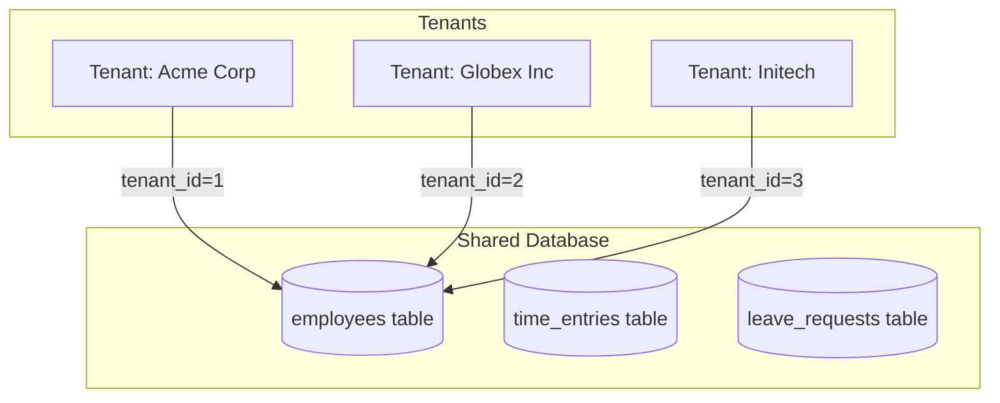
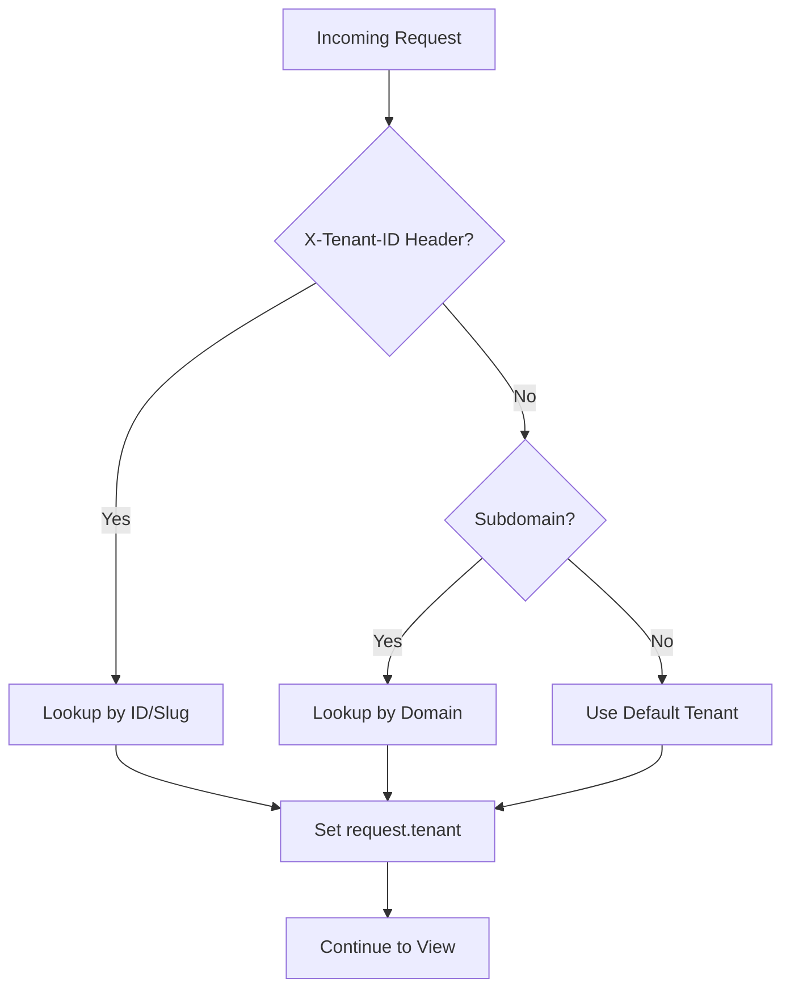
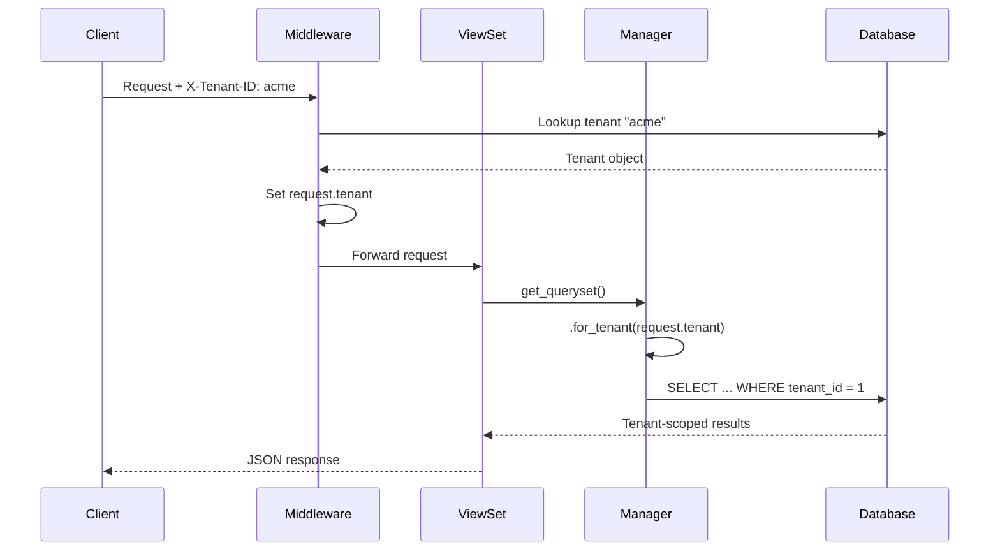
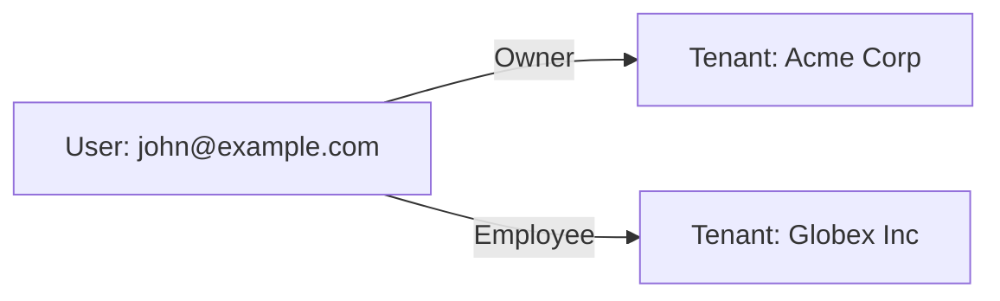

# Multi-Tenancy Architecture

Raptor HR uses a shared database multi-tenant architecture with row-level isolation. This document explains how tenant isolation works.

## Overview



## Isolation Model

### Shared Database with tenant_id

All tenant-scoped data includes a `tenant_id` foreign key:

```python
class Employee(TenantAwareModel):
    tenant = models.ForeignKey("tenants.Tenant", on_delete=models.CASCADE)
    first_name = models.CharField(max_length=150)
    # ... other fields
```

This approach provides:
- **Cost efficiency** - Single database instance
- **Simple operations** - Standard SQL queries
- **Easy maintenance** - Single schema to manage

## Core Components

### TenantAwareModel

Base class for all tenant-scoped models:

```python
# apps/core/models.py

class TenantAwareModel(TimestampedModel):
    """
    Abstract base model for all tenant-scoped models.
    All models that should be isolated per tenant should inherit from this.
    """

    tenant = models.ForeignKey(
        "tenants.Tenant",
        on_delete=models.CASCADE,
        related_name="%(app_label)s_%(class)s_set",
    )

    class Meta:
        abstract = True
```

### TenantAwareManager

Custom manager with tenant filtering:

```python
class TenantAwareManager(models.Manager):
    """Manager that supports tenant filtering."""

    def get_queryset(self):
        return TenantAwareQuerySet(self.model, using=self._db)

    def for_tenant(self, tenant):
        return self.get_queryset().for_tenant(tenant)
```

Usage:
```python
# Get employees for a specific tenant
employees = Employee.objects.for_tenant(tenant).all()
```

### TenantMiddleware

Resolves the current tenant from the request:



```python
# apps/tenants/middleware.py

class TenantMiddleware:
    def __init__(self, get_response):
        self.get_response = get_response

    def __call__(self, request):
        # Try X-Tenant-ID header first
        tenant_id = request.headers.get("X-Tenant-ID")

        if tenant_id:
            request.tenant = Tenant.objects.filter(
                Q(id=tenant_id) | Q(slug=tenant_id)
            ).first()
        else:
            # Fall back to subdomain
            host = request.get_host().split(":")[0]
            subdomain = host.split(".")[0]
            request.tenant = Tenant.objects.filter(
                Q(slug=subdomain) | Q(domain=host)
            ).first()

        return self.get_response(request)
```

### TenantAwareViewSet

Base ViewSet that automatically filters by tenant:

```python
# apps/core/views.py

class TenantAwareViewSet(viewsets.ModelViewSet):
    """
    ViewSet that automatically scopes queries to the current tenant.
    """

    def get_queryset(self):
        queryset = super().get_queryset()
        if hasattr(self.request, "tenant") and self.request.tenant:
            return queryset.for_tenant(self.request.tenant)
        return queryset.none()

    def perform_create(self, serializer):
        serializer.save(tenant=self.request.tenant)
```

## Request Flow



## User-Tenant Relationships

Users can belong to multiple tenants with different roles:



### TenantMembership Model

```python
class TenantMembership(TimestampedModel):
    ROLE_CHOICES = [
        ("owner", "Owner"),
        ("admin", "Admin"),
        ("manager", "Manager"),
        ("employee", "Employee"),
        ("viewer", "Viewer"),
    ]

    user = models.ForeignKey(User, on_delete=models.CASCADE)
    tenant = models.ForeignKey(Tenant, on_delete=models.CASCADE)
    role = models.CharField(max_length=20, choices=ROLE_CHOICES)
    is_default = models.BooleanField(default=False)

    class Meta:
        unique_together = ["user", "tenant"]
```

### Role Permissions

| Role | Employees | Time | Leave | Contracts | Settings |
|------|-----------|------|-------|-----------|----------|
| **Owner** | Full | Full | Full | Full | Full |
| **Admin** | Full | Full | Full | Full | Read |
| **Manager** | Team | Team | Team | Read | None |
| **Employee** | Self | Self | Self | Self | None |
| **Viewer** | Read | Read | Read | Read | None |

## Tenant Resolution

### Via HTTP Header

```http
GET /api/v1/employees/
Authorization: Bearer <token>
X-Tenant-ID: acme-corp
```

### Via Subdomain

```
https://acme-corp.app.rhr.com/api/v1/employees/
```

### Via Custom Domain

Tenants can configure custom domains:

```
https://hr.acme.com/api/v1/employees/
```

Mapped to tenant via the `domain` field.

## Creating a New Tenant-Aware Model

1. **Inherit from TenantAwareModel:**

```python
from apps.core.models import TenantAwareManager, TenantAwareModel

class Project(TenantAwareModel):
    name = models.CharField(max_length=255)
    description = models.TextField(blank=True)
    is_active = models.BooleanField(default=True)

    objects = TenantAwareManager()

    class Meta:
        ordering = ["name"]
        unique_together = ["tenant", "name"]  # Name unique per tenant
```

2. **Create ViewSet:**

```python
from apps.core.views import TenantAwareViewSet

class ProjectViewSet(TenantAwareViewSet):
    queryset = Project.objects.all()
    serializer_class = ProjectSerializer
```

3. **Run migrations:**

```bash
python manage.py makemigrations
python manage.py migrate
```

## Security Considerations

### Query Isolation

Always use the tenant-aware manager:

```python
# CORRECT - Uses tenant filtering
employees = Employee.objects.for_tenant(request.tenant).all()

# WRONG - Bypasses tenant isolation
employees = Employee.objects.all()  # Returns ALL employees!
```

### Permission Checks

Verify user membership in tenant:

```python
def has_tenant_access(user, tenant):
    return TenantMembership.objects.filter(
        user=user,
        tenant=tenant
    ).exists()
```

### Cross-Tenant References

Prevent cross-tenant data leaks in serializers:

```python
class EmployeeSerializer(serializers.ModelSerializer):
    department = serializers.PrimaryKeyRelatedField(
        queryset=Department.objects.none()  # Default to empty
    )

    def __init__(self, *args, **kwargs):
        super().__init__(*args, **kwargs)
        request = self.context.get("request")
        if request and hasattr(request, "tenant"):
            # Only allow departments from same tenant
            self.fields["department"].queryset = Department.objects.for_tenant(
                request.tenant
            )
```

## Testing Multi-Tenancy

```python
import pytest
from apps.tenants.models import Tenant
from apps.employees.models import Employee

@pytest.fixture
def tenant_a():
    return Tenant.objects.create(name="Tenant A", slug="tenant-a")

@pytest.fixture
def tenant_b():
    return Tenant.objects.create(name="Tenant B", slug="tenant-b")

def test_tenant_isolation(tenant_a, tenant_b):
    # Create employee in tenant A
    emp_a = Employee.objects.create(
        tenant=tenant_a,
        employee_id="001",
        first_name="John",
        last_name="Doe",
        hire_date="2024-01-01",
    )

    # Create employee in tenant B
    emp_b = Employee.objects.create(
        tenant=tenant_b,
        employee_id="001",  # Same ID, different tenant
        first_name="Jane",
        last_name="Smith",
        hire_date="2024-01-01",
    )

    # Verify isolation
    assert Employee.objects.for_tenant(tenant_a).count() == 1
    assert Employee.objects.for_tenant(tenant_b).count() == 1
    assert Employee.objects.for_tenant(tenant_a).first() == emp_a
    assert Employee.objects.for_tenant(tenant_b).first() == emp_b
```
